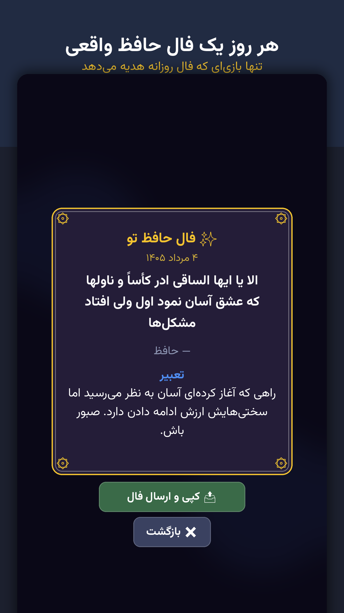

# بریز و بساز — Beriz o Besaz

**A Persian, offline-first merge puzzle for Android, built with Godot 4.7 — published as a working
reference for shipping to Cafe Bazaar and Myket.**

Drop numbered tiles into columns, merge equal neighbours, chain them for multiplied scores while
rising garbage rows and unbreakable stone tiles push back. Every day the game gives you a
**فال حافظ** — a classical Persian verse — and puts your run on a global leaderboard.

Made by **1xai Games Studio**. MIT licensed, including the parts that were hardest to get right.

<p align="center">
  
  
  
</p>

**[⬇ Download the APK](../../releases/latest)** — four builds: Cafe Bazaar, Myket, a PC-emulator
build, and one with no permissions at all.

---

## Why this repository might be useful to you

There is very little public, working, cleanly-licensed code for shipping a **Godot 4** game to the
**Iranian Android stores**. This repo is the whole thing, not a snippet:

| If you need… | Look at |
|---|---|
| **Myket in-app purchases in Godot 4** | [`games/mergedrop/addons/myket`](games/mergedrop/addons/myket) — an MIT plugin (Java + AIDL + GDScript) **written from scratch** for this project. Myket's own billing library ships source files with no licence grant, and the existing Godot plugins depend on it, so none were safe to ship. Full source included. |
| **Cafe Bazaar (Poolakey) purchases** | [`games/mergedrop/scripts/iap.gd`](games/mergedrop/scripts/iap.gd) — one GDScript API drives either store; the plugin is loaded dynamically so builds without it still run. |
| **Two stores, one codebase** | [`pipeline/build_stores.sh`](pipeline/build_stores.sh) — builds one APK per store and **fails the build** if either store's billing permission or classes leak into the other's APK. |
| **Persian / RTL UI in Godot** | [`games/mergedrop/scripts/ui_kit.gd`](games/mergedrop/scripts/ui_kit.gd), [`i18n.gd`](games/mergedrop/scripts/i18n.gd) — Persian digits, RTL layout, and a font-fallback test that catches missing glyphs (tofu boxes) before release. |
| **Jalali (Shamsi) calendar** | [`games/mergedrop/scripts/jalali.gd`](games/mergedrop/scripts/jalali.gd) — conversion, Persian date formatting, Yalda/Nowruz detection, with tests. |
| **Headless testing for a Godot game** | 136 GUT tests that need no display and no device — including layout-overlap guards, glyph coverage, and a bot that plays the real UI to game over. |
| **Local notifications with a policy** | [`games/mergedrop/scripts/notify.gd`](games/mergedrop/scripts/notify.gd) — quiet hours, timezone-correct scheduling, and back-off when reminders go ignored. |
| **An offline-first leaderboard** | [`server/`](server) — a dependency-free Python server; the client queues scores locally and uploads them when a network appears. |

Every mistake made along the way is written down in **[LESSONS.md](LESSONS.md)** — 54 numbered
rules, each from a real failure (a release-only hang, a store rejection risk, a timezone bug that
broke streaks for every player in Iran between midnight and 3:30 AM).

---

## The game

- **Merge puzzle with real pressure.** Levels push new rows up from the bottom; stone tiles cannot
  merge and must be destroyed by merging beside them. Every run eventually ends.
- **Daily challenge.** 60 moves on a date-seeded board that is *identical for every player in the
  country* — with [a test](games/mergedrop/tests/test_shared_board.gd) proving two players who
  play differently still receive the same tile sequence.
- **فال حافظ.** Open the game on a new day and receive that day's verse, revealed through a
  «نیت» press-and-hold ceremony and kept in a گنجینه treasury. 80 verses from Hafez, Saadi, Rumi,
  Khayyam, Ferdowsi and Baba Taher — each cross-checked by multiple independent AI models before
  being included; candidates that failed were discarded.
- **Global leaderboard** with unique nicknames, fully playable offline.
- **A companion.** «جغد», an owl who reacts to your streak, your record and your world rank.
- **Economy** with unlimited consumables and cosmetics. No loot boxes, no gacha, nothing that
  affects fairness — Iranian stores ban gambling-style monetisation.

---

## Layout

```
games/mergedrop/     the game (Godot 4.7 project)
  scripts/           pure-logic core, screens, platform adapters
  tests/             136 GUT tests, all headless
  addons/myket/      Myket billing plugin (ours, MIT, source included)
  addons/poolakey/   Cafe Bazaar billing plugin
server/              global scoreboard (Python, no dependencies)
pipeline/            headless build + QA automation
templates/           shared pieces for new games
ci/                  GitHub Actions workflow for the test suite
```

Docs: **[GAME_BLUEPRINT.md](GAME_BLUEPRINT.md)** (what a game must ship and why) ·
**[PLAYBOOK.md](PLAYBOOK.md)** (how it is built) · **[LESSONS.md](LESSONS.md)** (54 binding rules) ·
**[ENGAGEMENT.md](ENGAGEMENT.md)** (retention design) · **[THIRD_PARTY.md](THIRD_PARTY.md)** (licences).

---

## Build and test

Everything runs headlessly — no editor, no display, no device.

```bash
# tests
cd games/mergedrop
godot --headless --path . -s addons/gut/gut_cmdln.gd -gdir=res://tests -ginclude_subdirs -gexit

# a bot plays the real UI to game over three times
godot --headless --path . -- --autoplay

# full gate: import, tests, smoke run, autoplay, exports
pipeline/check_game.sh mergedrop

# one APK per store, with cross-store leakage checks
pipeline/build_stores.sh mergedrop
```

The Android builds need Godot's Gradle template (`android/build/`) plus a JDK 17 and the Android
SDK; the store presets and the reasoning behind them are documented in
[`releases/mergedrop/SUBMISSION.md`](releases/mergedrop/SUBMISSION.md).

## Scoreboard server

```bash
cd server
PORT=3000 python3 scoreboard.py
```

Routes are namespaced per game (`/api/<game>/…`), so one process serves several titles: claim a
unique nickname, submit a score (best-kept-wins, so a later worse run never lowers a rank), fetch a
board with your own position. See [`server/README.md`](server/README.md). The game treats it as
entirely optional — with the server down, play is unaffected and scores upload later.

---

## فارسی

**بریز و بساز** یک بازی پازل ایرانی برای اندروید است که با موتور گودو ۴ ساخته شده: کاشی‌های عددی را
در ستون‌ها بینداز، کاشی‌های مساوی را ادغام کن و زنجیره بساز. هر روز یک **فال حافظ** می‌گیری و
رکوردت روی جدول جهانی ثبت می‌شود. بازی کاملاً آفلاین کار می‌کند و بدون تبلیغ است.

این مخزن علاوه بر خود بازی، ابزارهای انتشار روی **کافه‌بازار** و **مایکت** را هم دارد — از جمله یک
افزونهٔ **پرداخت درون‌برنامه‌ای مایکت** برای گودو ۴ که مخصوص همین پروژه و با پروانهٔ MIT نوشته شده،
تقویم **شمسی (جلالی)**، رابط کاربری **راست‌به‌چپ فارسی** و آزمون‌های خودکار بدون نیاز به دستگاه.

---

## Licence

MIT — see [LICENSE](LICENSE). Vendored components keep their own licences, listed in
[THIRD_PARTY.md](THIRD_PARTY.md). The classical Persian poetry is public domain.

© 2026 **1xai Games Studio**
