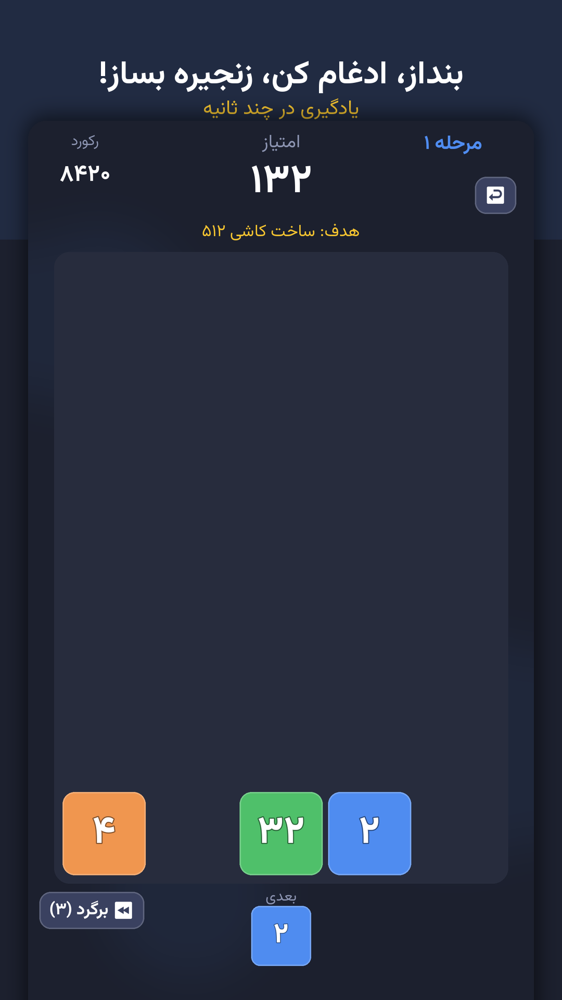
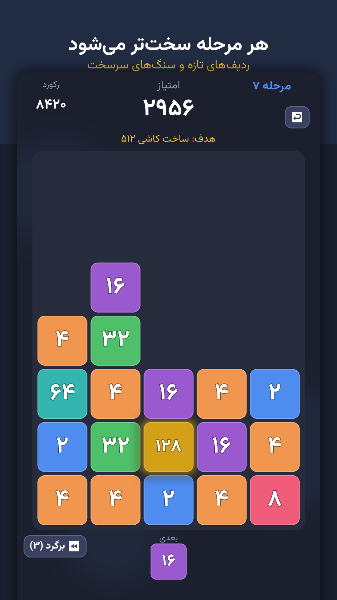
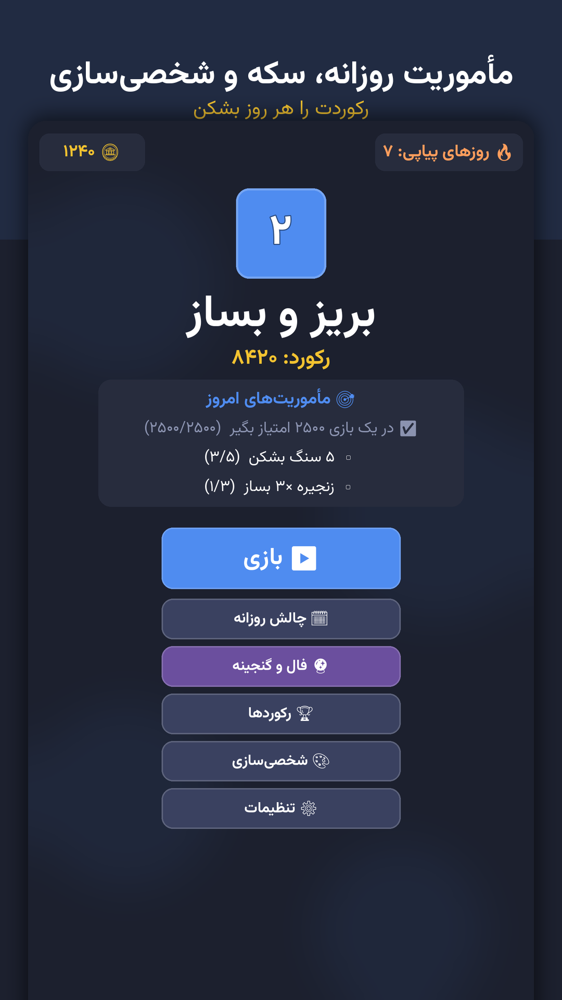

# Agentic Game Factory

**An AI agent builds complete mobile games end to end — design, code, art, music, automated tests,
store assets, monetisation and a signed release — with a human involved at only two gates.**

[](LICENSE)
[](https://godotengine.org)
[](games/mergedrop/tests)
[](markets/)

This is not a prompt collection. It is the working machinery — procedures, guardrails, headless
build and QA automation, store packaging — plus **56 numbered rules distilled from real failures**,
and a complete game as proof that the machinery produces something real.

An agent starts at [**AGENTS.md**](AGENTS.md), reads which market it is building for from
[`factory.json`](factory.json), and goes.

---

## How it works

```
concept → human approval → pure game logic + tests → screens → generated art & audio
        → feature baseline → QA gates → store package → milestone build → feedback → LESSONS.md
```

The human decides two things: **is this concept worth building**, and **does this build feel
right**. Everything else — architecture, implementation, testing, asset generation, store
compliance, packaging — is the agent's.

Two commands are the whole quality bar:

```bash
pipeline/check_game.sh <slug>     # import, unit tests, smoke run, autoplay bot, exports
pipeline/build_stores.sh <slug>   # one artifact per store, with cross-store leakage checks
```

### What makes it actually work

- **All game rules live in a pure, scene-free class.** That one decision is why 136 tests run with
  no display and no device — an agent can verify its own work without a human or a phone.
- **A bot plays the real UI.** Unit tests miss "the button does nothing"; a headless run drives the
  same handlers a finger does, to game over, three times.
- **Guards for the bugs an agent cannot see:** layout-overlap tests at four aspect ratios, font
  glyph coverage (no tofu boxes), scroll-blocking detection, and a screenshot composer that doubles
  as a layout oracle.
- **Platform features hide behind `available()`** — billing, notifications, network. A missing
  plugin makes a feature invisible, never a crash.
- **Every failure becomes a numbered rule.** [LESSONS.md](LESSONS.md) is why the second game costs
  less than the first.

---

## Markets are pluggable — international by default

Store rules, billing SDKs, listing limits, compliance, language and cultural design live in
**market modules**, and nowhere else:

```jsonc
// factory.json
{ "markets": ["international"] }   // the default: English-first, worldwide
```

| Module | Stores | Language |
|---|---|---|
| [markets/international.md](markets/international.md) | Google Play, itch.io, Steam | English **(default)** |
| [markets/iran.md](markets/iran.md) | Cafe Bazaar, Myket | Persian |

Say *"target the Iran market"* or *"cover both"* and the agent switches the field and reads a
different module. Adding a market is **one file** — copy [`_TEMPLATE.md`](markets/_TEMPLATE.md) and
fill eleven sections. No core document is ever forked for a market, and nothing locale-specific is
applied unless its module is selected.

---

## The proof: a complete game

[`games/mergedrop`](games/mergedrop) — an offline-first merge puzzle built through this factory for
the Iran module and packaged for two stores.

<p align="center">
  
  
  
</p>

Built by the agent: the merge engine and its difficulty curve, a daily challenge with a *provably*
identical board for every player, a companion character that reacts to your streak and rank, an
economy, local reminders with a tested policy, an offline-first global leaderboard, a synthesised
two-stem soundtrack, generated art, and store listings.

**[⬇ Download the APKs](../../releases/latest)** · four builds, all signed.

---

## Reusable pieces

| Component | What it is |
|---|---|
| [`addons/myket`](games/mergedrop/addons/myket) | A **Myket in-app billing plugin for Godot 4** (Java + AIDL + GDScript), written from scratch and MIT — none with a clean licence existed. Source included. |
| [`scripts/iap.gd`](games/mergedrop/scripts/iap.gd) | One billing API driving multiple stores, loading plugins dynamically so builds without them still run. |
| [`pipeline/build_stores.sh`](pipeline/build_stores.sh) | One artifact per store; **fails the build** if a store's billing permission or classes leak into another's. |
| [`server/`](server) | Dependency-free Python leaderboard; the client queues scores offline and uploads when a network appears. |
| [`scripts/jalali.gd`](games/mergedrop/scripts/jalali.gd) | Jalali/Shamsi calendar in pure GDScript, with tests. |
| [`scripts/notify.gd`](games/mergedrop/scripts/notify.gd) | Local reminders with a *tested* policy: quiet hours, timezone-correct scheduling, back-off when ignored. |
| [`pipeline/make_screenshots.py`](pipeline/make_screenshots.py) | Renders store screenshots by mirroring the game's own layout constants — and catches layout bugs doing it. |

---

## Documentation

| File | Purpose |
|---|---|
| [AGENTS.md](AGENTS.md) | **Start here.** How the factory runs, and the market switch. |
| [factory.json](factory.json) | The only switchboard: markets, language, engine. |
| [markets/](markets/) | Store facts — the only place they live. |
| [GAME_BLUEPRINT.md](GAME_BLUEPRINT.md) | What every game must ship, and why. Market-agnostic. |
| [PLAYBOOK.md](PLAYBOOK.md) | How to build it, step by step. |
| [LESSONS.md](LESSONS.md) | 56 binding rules from real failures. |
| [ENGAGEMENT.md](ENGAGEMENT.md) | Retention design patterns. |
| [FACTORY.md](FACTORY.md) | Toolchain and machine setup. |
| [THIRD_PARTY.md](THIRD_PARTY.md) | Vendored components and their licences. |

---

## Build and test

Everything is headless — no editor, no display, no device.

```bash
cd games/mergedrop
godot --headless --path . -s addons/gut/gut_cmdln.gd -gdir=res://tests -ginclude_subdirs -gexit
godot --headless --path . -- --autoplay     # a bot plays the real UI to game over
```

Android builds need Godot's Gradle template, JDK 17 and the Android SDK. The leaderboard server is
`cd server && PORT=3000 python3 scoreboard.py`.

---

## Honest scope

- The agent writes the code, tests, art, audio and store material. **A human still creates store
  accounts, pays fees, holds the signing key and presses publish** — every market module lists
  those explicitly as human-only.
- The included game is packaged and verified, and **not yet published to a store**.
- In-app purchases are integrated and verified inside the built package, but a real purchase can
  only be exercised on a device with the store app installed and products created.
- The CI workflow ships at [`ci/`](ci) and is **not active** — enabling it needs a token with the
  `workflow` scope.

---

## Licence

MIT — see [LICENSE](LICENSE). Vendored fonts are SIL OFL and vendored addons keep their own MIT
licences under their authors; see [THIRD_PARTY.md](THIRD_PARTY.md).

© 2026 **1xai Games Studio**
